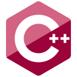

<!--Name Font taken from fontmeme.com-->
<h2 align="center">
  &#9889; Hey, I'm
  <a target="blank" href="https://heisenbuggs.github.io/">Prasuk Jain!!</a>
  &#9889;
</h2>

 &nbsp;
 &nbsp;
 &nbsp;
 &nbsp;

  
  
  <!-- Spotify Track -->
  
  

 
- &#128104;&#127995;&#8205;&#128187; **Software Developer by Profession and Passion!** working at @LinkedIn
- &#128205; Currently living in **Bengaluru, Karnataka, India**.
- &#x1f393; Graduated with **B.Tech.** in Electronics from **SGSITS, Indore**.
- &#128187; I’m currently learning about **System Design**.
- &#127911; Loves to listen **Music**, **Read Books** and **Explore Stocks** during chill time.
- &#x1f3af; Motto : **"Code is like humour. When you have to explain it, it's bad!!!"** &nbsp;

<!-- All skill images have been taken from https://github.com/devicons/devicon -->
<h2 align="left">Skills :</h2>

  
  
  
  
  
  
  
  
  
  <!--  -->
  
  

<!-- 

  
  

 -->
